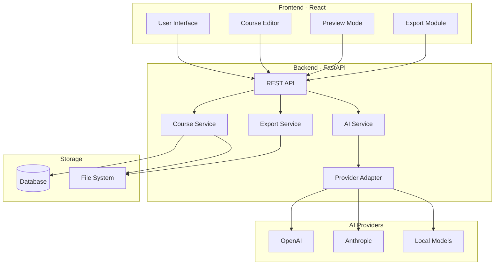

# AI Course Creator - Complete Implementation Plan

## Architecture Overview

Full-stack web application with:
- **Backend**: Python (FastAPI) with modular AI provider abstraction
- **Frontend**: React with TypeScript
- **Database**: SQLite (development) / PostgreSQL (production)
- **Storage**: File system for course content, optional cloud storage
- **AI Integration**: Pluggable provider system (OpenAI, Anthropic, local models)

### System Architecture



## Project Structure

```
ai-course-creator/
├── backend/
│   ├── app/
│   │   ├── __init__.py
│   │   ├── main.py                 # FastAPI application entry
│   │   ├── api/
│   │   │   ├── __init__.py
│   │   │   ├── routes/
│   │   │   │   ├── courses.py      # Course CRUD endpoints
│   │   │   │   ├── generation.py   # AI generation endpoints
│   │   │   │   ├── export.py       # Export endpoints
│   │   │   │   └── analytics.py    # Analytics endpoints
│   │   │   └── dependencies.py     # Shared dependencies
│   │   ├── core/
│   │   │   ├── config.py           # Configuration management
│   │   │   ├── database.py         # Database setup
│   │   │   └── security.py         # Authentication/authorization
│   │   ├── services/
│   │   │   ├── course_service.py   # Course business logic
│   │   │   ├── ai_service.py       # AI orchestration
│   │   │   ├── export_service.py   # Export functionality
│   │   │   └── analytics_service.py # Analytics
│   │   ├── providers/
│   │   │   ├── __init__.py
│   │   │   ├── base.py             # Base provider interface
│   │   │   ├── openai_provider.py  # OpenAI implementation
│   │   │   ├── anthropic_provider.py # Anthropic implementation
│   │   │   └── local_provider.py   # Local model implementation
│   │   ├── models/
│   │   │   ├── course.py           # Course data models
│   │   │   ├── content.py          # Content models
│   │   │   └── export.py           # Export models
│   │   └── utils/
│   │       ├── validators.py       # Content validation
│   │       └── formatters.py       # Content formatting
│   ├── tests/
│   └── requirements.txt
├── frontend/
│   ├── src/
│   │   ├── components/
│   │   │   ├── CourseEditor/
│   │   │   ├── CourseOutline/
│   │   │   ├── ContentGenerator/
│   │   │   ├── Preview/
│   │   │   ├── Export/
│   │   │   └── Analytics/
│   │   ├── services/
│   │   │   └── api.ts              # API client
│   │   ├── hooks/
│   │   ├── types/
│   │   └── App.tsx
│   ├── package.json
│   └── tsconfig.json
├── pyproject.toml
└── README.md
```

## Implementation Phases

### Phase 1: Foundation & Core Generation (MVP)
**Goal**: Basic course generation functionality

**Features**:
1. Course Outline Generation
2. Basic Content Generation (text lessons)
3. Simple Export (Markdown/PDF)

**Key Files**:
- `backend/app/services/ai_service.py` - Core AI orchestration
- `backend/app/providers/base.py` - Provider abstraction
- `backend/app/api/routes/generation.py` - Generation endpoints
- `frontend/src/components/CourseEditor/` - Basic editor UI

**Database Schema** (initial):
- Courses table (id, title, description, created_at, updated_at)
- Modules table (id, course_id, title, order)
- Lessons table (id, module_id, title, content, order)

### Phase 2: Enhanced Content & Assessment
**Goal**: Rich content types and assessments

**Features**:
4. Quiz and Assessment Generation
5. Practice Exercises Generation
6. Multi-Format Support (video scripts, slides)
7. Learning Objectives Alignment

**Key Files**:
- `backend/app/services/ai_service.py` - Extended with assessment generation
- `backend/app/models/content.py` - Assessment models
- `frontend/src/components/ContentGenerator/` - Enhanced generator UI

**Database Additions**:
- Quizzes table (id, lesson_id, questions)
- Exercises table (id, lesson_id, content)

### Phase 3: Personalization & Quality
**Goal**: Adaptive content and quality control

**Features**:
8. Adaptive Difficulty Levels
9. Content Personalization
10. Content Validation & Fact-checking
11. Content Improvement Suggestions

**Key Files**:
- `backend/app/services/ai_service.py` - Personalization logic
- `backend/app/utils/validators.py` - Validation utilities
- `backend/app/api/routes/generation.py` - Personalization parameters

### Phase 4: Multimedia & Enhancement
**Goal**: Rich media and visual content

**Features**:
12. Multimedia Integration (images, diagrams)
13. Code Example Generation
14. Visual Aids Generation
15. Accessibility Features

**Key Files**:
- `backend/app/services/media_service.py` - Media generation
- `backend/app/providers/` - Extended for image generation
- `frontend/src/components/MediaSelector/` - Media management UI

### Phase 5: Course Management
**Goal**: Advanced course organization

**Features**:
16. Course Templates
17. Version Control
18. Collaboration Features

**Key Files**:
- `backend/app/services/template_service.py` - Template management
- `backend/app/services/version_service.py` - Version control
- `backend/app/core/security.py` - User authentication
- `frontend/src/components/Collaboration/` - Collaboration UI

**Database Additions**:
- Templates table
- Versions table (course_id, version_number, content_snapshot)
- Users table
- Collaborators table (course_id, user_id, role)

### Phase 6: Advanced Export & Distribution
**Goal**: Professional export capabilities

**Features**:
19. Multiple Export Formats (SCORM, xAPI, HTML)
20. Platform Integration (LMS export)
21. Course Landing Pages

**Key Files**:
- `backend/app/services/export_service.py` - Export logic
- `backend/app/utils/formatters.py` - Format converters
- `frontend/src/components/Export/` - Export UI

### Phase 7: Analytics & Intelligence
**Goal**: Insights and optimization

**Features**:
22. Course Analytics (duration, coverage)
23. Content Gap Analysis
24. Interactive Preview
25. Bulk Operations

**Key Files**:
- `backend/app/services/analytics_service.py` - Analytics engine
- `backend/app/api/routes/analytics.py` - Analytics endpoints
- `frontend/src/components/Analytics/` - Analytics dashboard
- `frontend/src/components/Preview/` - Preview component

### Phase 8: Advanced AI Features
**Goal**: Cutting-edge AI capabilities

**Features**:
26. Translation & Localization
27. Advanced Accessibility (alt text, structure)
28. Learning Path Suggestions

**Key Files**:
- `backend/app/services/translation_service.py` - Translation
- `backend/app/services/accessibility_service.py` - A11y features
- `backend/app/services/path_service.py` - Learning path generation

## Technical Implementation Details

### AI Provider Abstraction

```python
# backend/app/providers/base.py
class BaseAIProvider(ABC):
    @abstractmethod
    async def generate_outline(self, topic: str, params: dict) -> CourseOutline:
        pass
    
    @abstractmethod
    async def generate_content(self, prompt: str, context: dict) -> str:
        pass
    
    @abstractmethod
    async def generate_assessment(self, content: str, params: dict) -> Assessment:
        pass
```

### Core API Endpoints

- `POST /api/courses` - Create course
- `POST /api/courses/{id}/generate-outline` - Generate outline
- `POST /api/courses/{id}/generate-content` - Generate lesson content
- `POST /api/courses/{id}/generate-assessment` - Generate quiz
- `GET /api/courses/{id}` - Get course
- `PUT /api/courses/{id}` - Update course
- `POST /api/courses/{id}/export` - Export course
- `GET /api/courses/{id}/analytics` - Get analytics

### Configuration Management

Environment-based configuration for:
- AI provider selection and API keys
- Database connection
- Export settings
- Feature flags for phased rollout

## Dependencies

**Backend**:
- FastAPI
- SQLAlchemy (ORM)
- Pydantic (validation)
- OpenAI SDK / Anthropic SDK
- ReportLab / WeasyPrint (PDF export)
- Jinja2 (templates)

**Frontend**:
- React + TypeScript
- React Router
- Axios
- React Query
- Material-UI or Tailwind CSS
- React Markdown (content rendering)

## Testing Strategy

- Unit tests for AI providers and services
- Integration tests for API endpoints
- E2E tests for critical user flows
- Mock AI responses for consistent testing

## Deployment Considerations

- Docker containerization
- Environment variable management
- Database migrations (Alembic)
- Frontend build and static serving
- Optional: Cloud storage for course files

## Feature List Summary

### Core Course Generation Features
1. Course Outline Generation
2. Content Generation (text, explanations, examples)
3. Quiz and Assessment Generation
4. Practice Exercises Generation
5. Multi-Format Support (video scripts, slides, tutorials)

### Content Enhancement Features
6. Adaptive Difficulty Levels
7. Content Personalization
8. Multimedia Integration (images, diagrams, code examples)
9. Visual Aids Generation
10. Learning Objectives Alignment

### Course Management Features
11. Course Templates
12. Version Control
13. Collaboration Features

### Quality & Assessment Features
14. Content Validation & Fact-checking
15. Content Improvement Suggestions
16. Assessment Generation with Rubrics

### Export & Distribution Features
17. Multiple Export Formats (PDF, HTML, Markdown, SCORM, xAPI)
18. Platform Integration (LMS export)
19. Course Landing Pages

### AI-Powered Features
20. Translation & Localization
21. Advanced Accessibility Features
22. Learning Path Suggestions

### Analytics & Intelligence Features
23. Course Analytics (duration, coverage)
24. Content Gap Analysis
25. Interactive Preview
26. Bulk Operations

